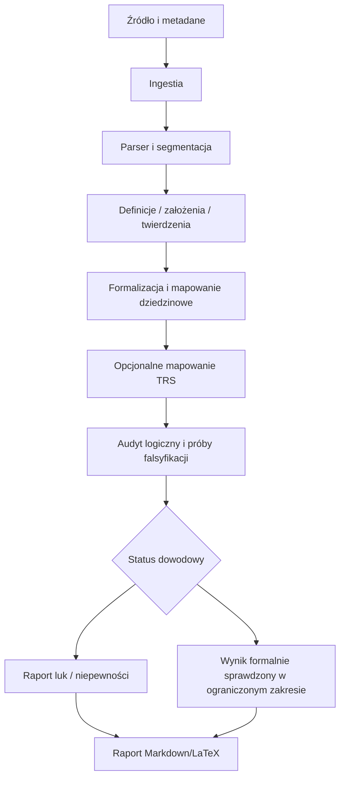

# Architektura docelowa i plan implementacji

## Moduły

1. **Ingestor** — przyjmuje materiał, zapisuje metadane i tworzy niezmienny identyfikator źródła.
2. **Parser** — rozpoznaje strukturę Markdown/LaTeX/PDF/OCR; zachowuje lokalizacje źródłowe.
3. **Claim Extractor** — wydziela definicje, założenia, lematy, twierdzenia, dowody i wnioski.
4. **Formalizer** — normalizuje zapis oraz identyfikuje niejednoznaczne symbole; nie dopisuje brakujących aksjomatów.
5. **Domain Mapper** — przypisuje elementy do P vs NP, RH, Hodge, BSD lub „inne/nieustalone”.
6. **TRS Adapter** — mapuje elementy na jawnie zdefiniowane konstrukcje TRS, jeśli definicje zostały dostarczone.
7. **Audit Engine** — sprawdza spójność, zależności, typy, kwantyfikatory i możliwe kontrprzykłady.
8. **Formal Verification Adapter** — opcjonalna warstwa dla asystentów dowodzenia (np. Lean/Coq), po określeniu wersji i zakresu.
9. **Report Generator** — tworzy raport Markdown/LaTeX, diagramy i rejestr niepewności.
10. **Orchestrator** — steruje kolejnością, limitami, śladami audytu i ponawianiem zadań.

## Przepływ danych



## Granice odpowiedzialności

- Model językowy proponuje analizę; walidator zewnętrzny sprawdza wybrane własności formalne.
- Parser nie może usuwać warunków ani zmieniać kwantyfikatorów bez śladu.
- TRS Adapter pozostaje wyłączony lub raportuje „brak formalnej specyfikacji”, gdy nie ma definicji i aksjomatów.
- Wynik solvera dotyczy wyłącznie zakodowanego zadania i nie automatycznie przenosi się na oryginalny problem.

## Etapy implementacji

### Etap 1 — dokumentacja i kontrakty
- utrwalić schemat raportu, statusy i format źródeł;
- przygotować zestaw przykładów poprawnych i błędnych argumentów;
- określić format śledzenia lokalizacji.

### Etap 2 — ingestia i parser
- obsłużyć Markdown i LaTeX jako pierwsze formaty;
- zachować mapowanie do numerów sekcji/wierszy;
- dodać PDF/OCR dopiero z testami jakości ekstrakcji.

### Etap 3 — ekstrakcja i audyt
- ekstrakcja twierdzeń do jawnego schematu danych;
- wykrywanie brakujących definicji i zależności;
- testy regresyjne dla znanych pułapek logicznych.

### Etap 4 — formalne adaptery
- wybrać środowisko dowodzenia i ustalić wersję;
- zdefiniować zakres automatycznej translacji;
- raportować nieprzetłumaczone fragmenty bez zgadywania.

### Etap 5 — TRS
- przyjąć formalną specyfikację TRS od autora;
- ocenić spójność definicji i aksjomatów;
- przygotować przykłady i kontrprzykłady;
- dopiero potem implementować mapowanie.

### Etap 6 — raportowanie i wydanie
- generowanie raportu z cytowaniem źródła;
- automatyczne testy, przykładowe dane i instrukcja uruchomienia;
- oznaczenie wersji i ograniczeń.

## Proponowany układ kodu (przyszły)

```text
agents/millennium-mathematics/
  README.md
  SPECIFICATION.md
  RESEARCH_PROTOCOL.md
  ARCHITECTURE.md
  VALIDATION.md
  diagrams/
  src/
  tests/
  examples/
```

Ten katalog obecnie zawiera dokumentację projektową; katalogi `src/` i `tests/` należy dodać wraz z pierwszą implementacją.
